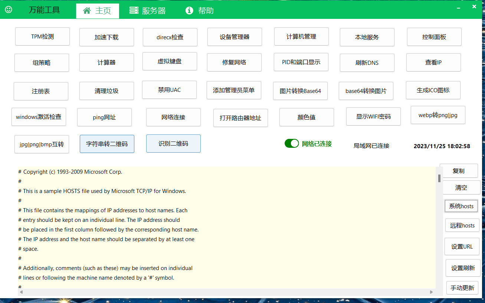
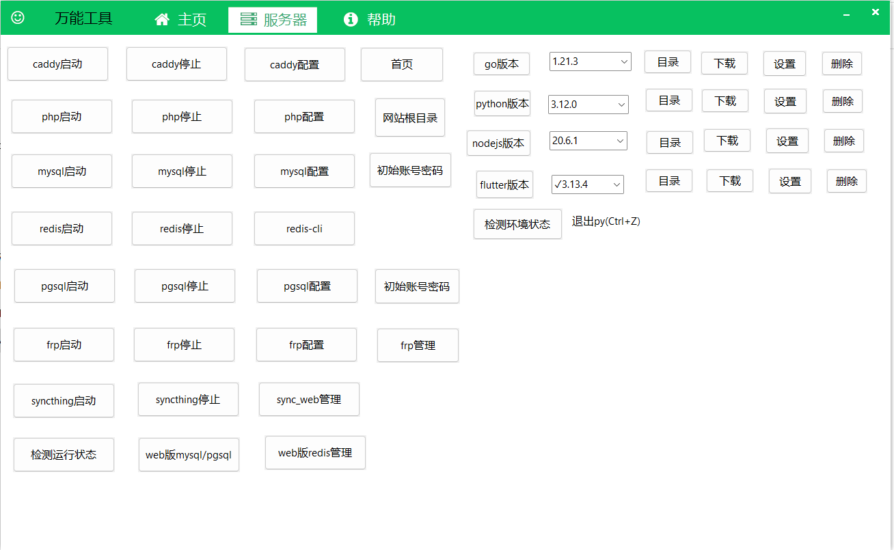
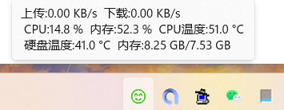
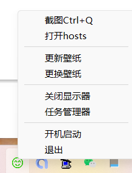
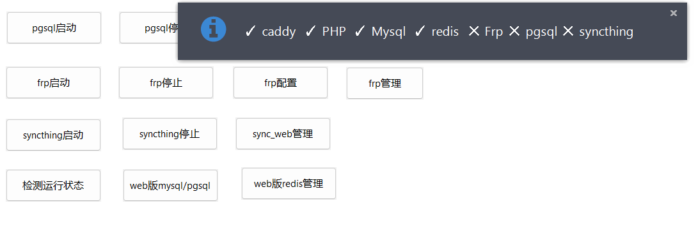
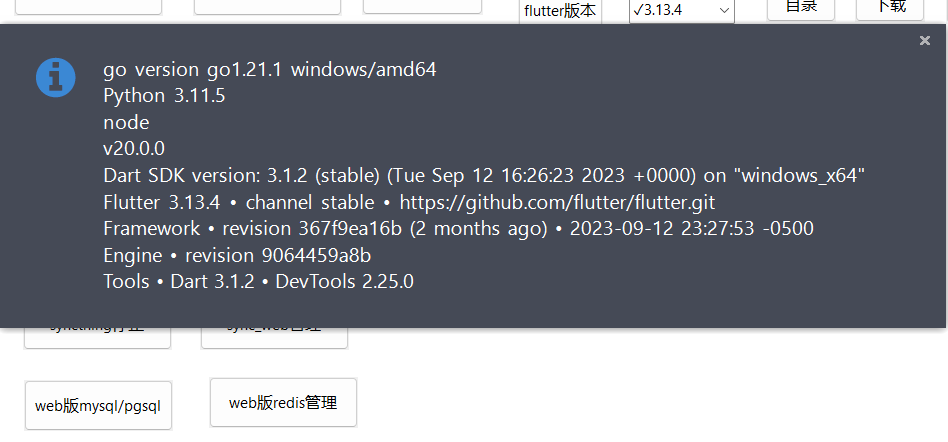

# 万能工具

## 简单介绍

aardio开发的万能工具,支持切换下载壁纸,安装go,nodejs,python,flutter多版本,php开发环境免配置,pgsql,mysql等等40多项功能.

## 常见功能

- Windows常见的一些功能快捷方式.

- 每天自动下载微软壁纸,自动半小时切换壁纸

- 显示实时网速,温度,内存等信息

- 截图功能,包含全局快捷键截图

- caddy+php+mysql+redis经典的php开发环境,免安装

- pgsql绿色版,syncthing服务器本地同步工具,frp内网穿透都能随时启动关闭.

- 支持安装多个版本的golang,flutter,python,nodejs,都是点点鼠标即可完成.

- 支持各种开发环境检测,常见的php开发环境包都可以抛弃了.因为本工具可以随时启动关闭,需要哪个就开启哪个.

- caddy是支持本地https://127.0.0.1或https://localhost这种的,如果有公网域名和IP还能实现泛解析.

- 采用aardio开发,源代码开放,安全有保证.可以修改成你自己需要的功能,也能开发你自己需要的功能.aardio确实非常容易写工具.

- 将于2023-11-21上线.
## 下载
- 可以自己编译, 也可以去发行版下载, 但是数据包caddy必须去发行版下载对应的.
## 自行编译
- 自己编译的话需要安装aardio<https://www.aardio.com/>, 没有的扩展自行下载.
- src是源码目录可以自己导入到aardio项目目录下;
- caddy是各种编程环境, 具体路径应放在C:\app下,包含frp内网穿透客户端, 服务端是你自己;
- mysql5.7版本和pgsql13, php7.2版本, redis7.0
- syncthing是一个同步工具, 支持本地服务器内容同步, 比如本地写的代码自动同步到自己服务器;
- wallpaper是壁纸文件夹, 每月存储一个文件夹.
- www是网站文件夹, db里面是数据库redis的web工具.
- caddy配置文件是Caddyfile, 非常简单写法, 支持https本地.
- 下载的go nodejs python flutter在app目录下相应文件夹内.
- caddy.7z就是服务器相关全部, 解压到c:\app下面即可.
- yoby.exe是绿色文件可以放到任意目录.

## 更新日志
- v1.0.1122 修复php不能运行, 在caddy目录添加temp目录用于php的session存储, 增加web版本redis, 修复检测flutter乱码, 新增普通下载按钮.
- v1.0.1121 初次发布, 其他版本php，mysql，pgsql，redis，caddy, frp, syncthing都是支持自己替换对应版本的, 你需要什么版本就直接替换文件夹即可.后续会发布不同版本的php, mysql, pgsql, redis等.这也是一个PHP集成环境服务.常见的nginx用caddy替换了, 主要是caddy配置更简单, 支持本地开发https, 自动https域名, 配合frp能开发小程序, app这种必须要https的域名.配合frp, 我们可以虚拟出无数个3级域名, 比如我自己的 xxx.api.shanliwawa.top, 前面的xxx可以自定义任何数字英文符号.
## 截图参考

